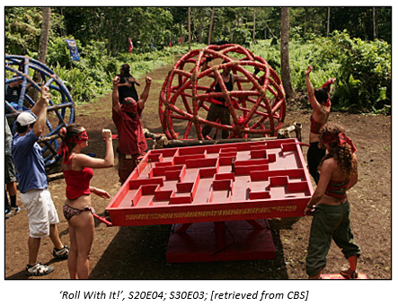
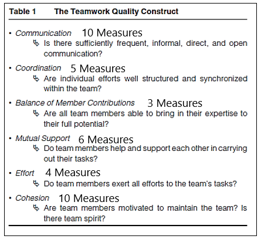

### Research Practicum 2020 – Research Plan 

# Teamwork Quality and Individual Opportunity for Success Through the Reality TV Show Survivor.

## The Survivors
>Michael Allen 
>Austin Kriznar  
>Jessica Williams 

## General Introduction

**Topic:** 
This study uses Survivor as a series of case studies to evaluate measures of teamwork quality and evaluate opportunity or success. This study ultimately seeks to answer the economy of effort question all individual on a team face: Is it more advantageous to focus on personal ambition or the quality of the team? 

### Definitions:

*Post-collaboration / post-project:* The period after the team in study has been dissolved, either due to project completion or any other reason, and former team members compete against one another for individual gain.  <<<<< Do we need this one?

*Teamwork Quality:* A measure of collaboration as measured by the facets of communication, coordination, balance of member contributions, mutual support, effort, and cohesion. (Hoegl & Gemuenden, 2001) 

*Team Success:* the extent to which a team meets established objectives. (Hoegl & Gemuenden, 2001) 

*Opportunity for Success:* the opportunity to compete in a post-collaboration competition. Placing in the Final 4. 

*Individual Success:* Winning the post-collaboration competition or post-project reward. The Sole Survivor. 

### Assumptions:             <<<<<<<<<<<<<<<<<<<
This study seeks to evaluate certain aspects of attitudes towards teamwork, but the observed population is unavailable for observation. In this capacity, recorders make assumption as though they themselves are a contestant answering the question which may allow rater bias to interfere. 

### Limitations: 
Survivor is recorded for network television and only the edited post-production copies of footage were available for observation for this study. This means that the observational scope has already been filtered in some capacity and made produce an unintentional bias in recorded responses 

# INTRODUCTION
Teamwork dominates the professional and academic landscape. It is difficult to find a job that does not involve some measure of teamwork or to pass an interview without demonstrating some evidence of having functioned as a member of a team. **CCC** Combining skilled individuals onto teams is a way to maximize creative talent, cross-level skills, and produce a much stronger product that one individual working alone. When teams are aligned towards a common goal, productivity can usually be assumed, and outcomes will approach optimization.  

However, teams are still made of individuals and people live individual lives and enjoy individual recognition and rewards. Leaders struggle to find ways to motivate individual to commit to team goals and often resort to introducing individual rewards. Introducing individual rewards can create a conflict of interest and a aggravate the ever-present challenge of maintaining balance between individual and collective goals. 

# BACKGROUND

In the current professional setting, teams are purpose built, meaning they are not created simply for the sake of being. This specific purpose may present itself in a way that inherently defines success differently for the team and the individual members of the team (Brown et al., 2016). Teams are also typically brought together in an Ad hoc fashion (Stone et al., 2010) and composed of multidisciplinary or transdisciplinary elements (Flowers et al., 2000). The transdisciplinary nature of these teams means that they already come at problems, and even teamwork, from different vantage points (Zeigler, 1990). This complicates attempts to maintain a singular focus on team objectives, particularly because interests and goals may not be aligned at the disciplinary level, let alone the individual level (Garrett-Jones et al., 2005).  

The rift that often misaligns team and individual goals is further exacerbated by the existence of individual rewards that are extraneous, or at least tangential to, the overall team goal. These include individual rewards like personal recognition for contributions, a promotion going to the highest performing member of the team, or a follow-on research grant. Individuals competing for individual goals beyond the larger team goal can have an impact on overall team success. 

>>>>>> check this might ditch or expand 

The competitive construct within the Survivor model pits 20 contestants against one another in a winner-take-all contest for $1,000,000. Players begin on a randomly assigned Ad hoc team and compete against the other team in a series of ‘challenges’. The losing team sends one individual home. Gameplay continues in this fashion until the two teams ‘merge’ into one tribe and the individual phase of the competition begins. The game then continues as a series of individual contests where one person is eliminated until the Final 4 contestants compete for overall victory in the final episode. 

## Purpose Statement 
The purpose of this study is to explore the relationship between attributes of whole-team teamwork quality and an individual’s likelihood to advance to the final stage of the winner-take-all reality TV show Survivor.  

## Contributions

>* Adapt a model to capture how unique facets of teamwork quality effect team member opportunity for success in post-collaboration competition.  
>
>* Quantitatively assess which aspects of teamwork (as measured by the Teamwork Quality assessment) are most impactful on individual team members' outcomes in collaborative environments. 
>
>* If possible, determine effect sensitivity of measures 

## **Related Work**####    <<<<<<<<<<<<<<<<<<<<<<<<<

The framework for this study is built on the scaffold of several previous investigations into teamwork and team functionality. The primary work called upon in the formation of this stud is Hoegl & Gemuenden's 2001 article, ["Teamwork Quality and the Success of Innovative Projects: A Theoretical Concept and Empirical Evidence"](relevant_papers/Teamwork_Quality_and_the_Success_of_Innovative_Pro.pdf) published in the journal <em>Organization Science</em>. This article both establishes a definition for Teamwork Quality, that is used throughout this study, and provides a framework and tool for quantitatively assessing the measure of Teamwork Quality. The study includes methods for weighting the different facets and conducting final aggregation of the collected data.

Hoegl & Gemuenden’s findings in that article also provide support for the idea that increasing teamwork quality increases team success. These findings form the basis for this study's implication that a positive correlation between teamwork quality individual opportunity for success will increase the individual's desire to emphasize teamwork quality and thereby team performance.

The broader correlation and assumption of contribution for this study is based on a 2002 study conducted at the University of Nebraska - Lincoln by Adams & Ulloa and published in <em>Team Performance Management</em>, titled ["Attitude Toward Teamwork and Effective Teaming"](relevant_papers/Attitude%20toward.pdf). The study effectively validated that individuals' attitude toward teamwork directly affected the productivity of their team. In light of these findings this study makes the claim, that should a positive correlation be found between teamwork quality and individual success, a positive attitude shift will work in tandem with increased teamwork quality to yield better overall team performance.

## Problem Statement 
Many team projects contain elements of competitive individual post-project rewards. When presented with the presence of extraneous rewards, individuals may neglect aspects of teamwork and collaboration in pursuit of individual goals. Individuals interested in maximizing opportunity for success in post-project competitions may be unsure of whether to focus personal energies on maximizing teamwork quality or abandoning collaborative behaviors in pursuit individual goals.  

**Proposed Solution** 
This study will observe several seasons of the reality TV show Survivor and use the 2001 Teamwork Quality Framework to evaluate measures of teamwork quality against opportunity for success in post-collaboration competition to determine which individual approach is most advantageous.

**Research Questions** 

>* What facet(s) of team collaboration are the best indicators of producing opportunity for success? 
>
>* What relationship exists between the season winners / top 4 and their seminal team’s overall TWQ in early gameplay?  
>
>* What can people leading teams take away to most effectively implement in ‘real life’? 
 

## Hypotheses 

<ins>H1:</ins> Some facets of TWQ will be significant indicators of opportunity for success for teams  

<ins>H2:</ins> Teams that win more will have greater overall TWQ scores 

<ins>H3</ins> (Pending H1 and H2): Winning teams will have higher TWQ factor scores when containing a season winner.  

<ins>H4</ins> (Pending H3): Teams that score higher in overall TWQ will place more contestants in the Final 4 (e.g., wider ranges for opportunities for success). 

# RESEARCH METHOD

What is the name of this method Qual Quant something clever

## Aparatus 

### Model 

 

The survivor model offers several factors that make it an excellent sample set for observation of teamwork quality measures in the context outlined by the research questions posed by this study. The show includes 20 years’ worth of recorded seasons which include contestants from a wide variety of social backgrounds and regions around the United States. Contestants initially compete as part of Ad hoc teams. The team challenges that contestants compete in require a wide array of teamwork behaviors and offer ample observation of teamwork quality measures.  

During the team phase of competition, the winner-take-all nature of the overall contest is overtly known to all contestants, as is the fact that only the Final 4 get the opportunity to compete for the overall prize. 

### Tool 
Martin Hoegl and Hans Georg Gemuenden’s (2001) Teamwork Quality (TWQ) framework provided a useful tool that is ideal for this study because is allows researchers to quantitatively measure teamwork quality using 38 measures across 6 facets. The tool has been validated and used extensively in the study of teamwork quality. It is easily translatable to the Survivor model because it uses a Likert scale and allows a range of recorders to input observations with minimal training. 

The recorder version of the [Teamwork Quality Assessment Tool](http://ucf.qualtrics.com/jfe/form/SV_2gg1V4BExgotmMB) can be viewed at the preceding link. This tool displays all measure in their corresponding categories.

### Measures 

chop in visuals?) 

**Facets of Teamwork Quality** 
 

> Communication 
>* 
> Coordination 
>
> Balance of Member Contributions 
>
> Mutual Support 
>
> Effort 
>
> Cohesion 
>

**Quantity advanced to the Final 4**  

**Presence of Sole Survivor**  

**Samples Population:** 96 Survivor contestants  

**Sample Size:** 125 Samples   
*5 seasons*  
*33 episodes*  

Independent Variables:

Dependent Variables:

## Protocol 

*Note: Recorder assignments overlapped on every episode observed to mitigate rater bias in this study.

**Data Collection** 

Raters watched pre-recorded episodes of Survivor and evaluated team's performance and teamwork quality measures via a Qualtrics survey that contained the TWQ measures, in accordance with  Hoegl and Gemuenden's Teamwork Quality framework. 

After each trial (episode), using a web-browser to access the Qualtrics survey, the raters scored each team's performance for that challenge via observed TWQ measures. 

Raters repeated these steps for all remaining pre-merge episodes from their assigned seasons.

**Data Preperation** 

All data was aggregated in Qualtrics and then exported as a .csv file. Reverse coded questions were corrected and samples that failed to meet completion or verificaton standards were eliminated.

The presence of the Sole Survivor on a team was hand coded the sample as a binary measure of 1 or 0, and the quantity of Final 4 qualifiers was hand coded into each sample as a raw number between 1 and 4 as appropriate.

The resulting .csv file was loaded into *Jeffreys's Amazing Statistics Program* (JASP) to produce a series of graphs and comparison charts for analysis.

The [Teamwork Quality Assessment Tool](http://ucf.qualtrics.com/jfe/form/SV_2gg1V4BExgotmMB) records the raters observations of the teams' performance in the dimensions of the six facets of teamwork quality as outlined by Hoegl & Gemuenden.

### REMAINING STUFF FROM TEMPLATE

(Add real-world examples, if any)
Maybe add job listing

Personal example of promotion following specific tour

(Put the problem into a historical context, from what does it originate? Are there already some proposed solutions?)

Things to research:

(Motivation. Why is this problem interesting and relevant to the research community?)

## References 
 
(Add the bibliographic references you intend to use in format you want)
  
___________________________________
The final project will consist of a: (1) Pitch - team formation, (2) proposal,  (3) midpoint review, (brief) presentation (~ 15min), and a final paper/code/data. This will be a group work project of a small team.

