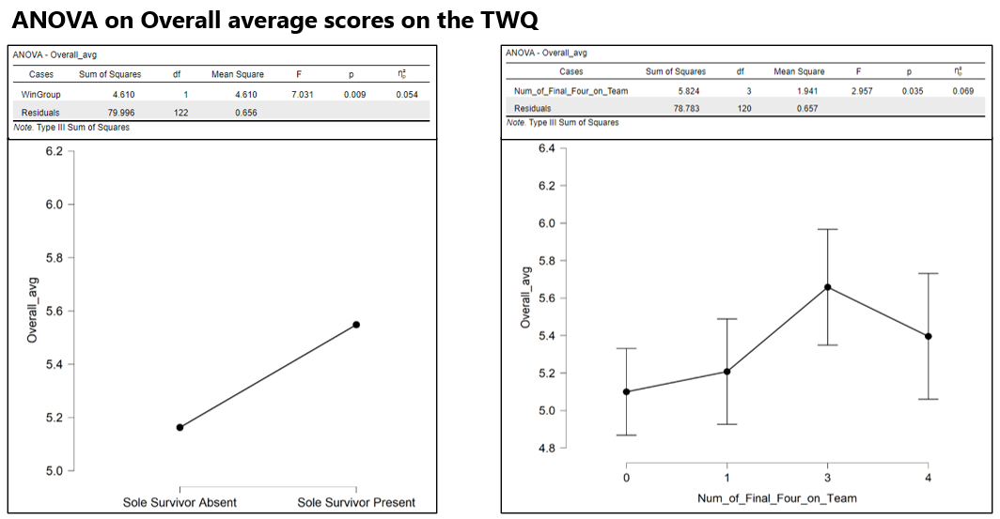
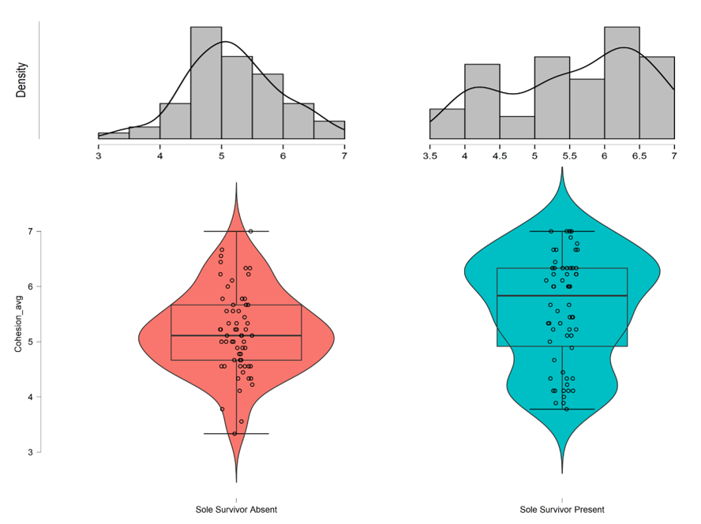
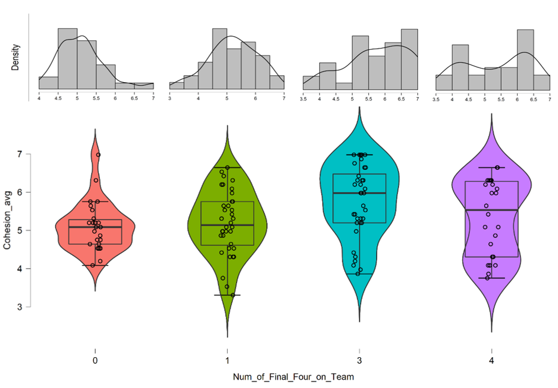
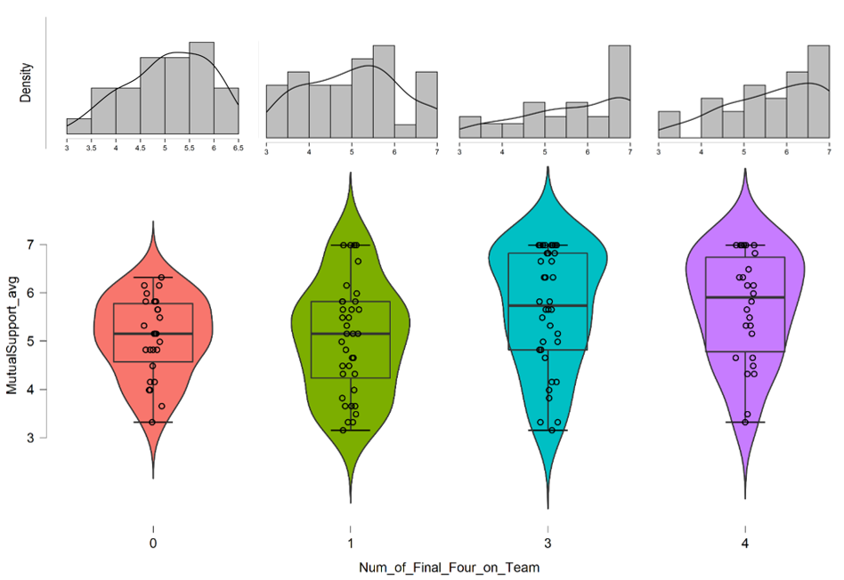

### Research Practicum 2020 – Research Plan 

# Teamwork Quality and Individual Opportunity for Success Through the Reality TV Show Survivor.

## The Survivors
>Michael Allen 
>Austin Kriznar  
>Jessica Williams 

## General Introduction

**Topic:** 
This study uses Survivor as a series of case studies to evaluate measures of teamwork quality and evaluate opportunity or success. This study ultimately seeks to answer the economy of effort question all individual on a team face: Is it more advantageous to focus on personal ambition or the quality of the team? 

### Definitions:

*Post-collaboration / post-project:* The period after the team in study has been dissolved, either due to project completion or any other reason, and former team members compete against one another for individual gain. 

*Teamwork Quality:* A measure of collaboration as measured by the facets of communication, coordination, balance of member contributions, mutual support, effort, and cohesion. (Hoegl & Gemuenden, 2001) 

*Team Success:* the extent to which a team meets established objectives. (Hoegl & Gemuenden, 2001) 

*Opportunity for Success:* the opportunity to compete in a post-collaboration competition. Placing in the Final 4. 

*Individual Success:* Winning the post-collaboration competition or post-project reward. The Sole Survivor. 

### Assumptions:           
This study seeks to evaluate certain aspects of attitudes towards teamwork, but the observed population is unavailable for observation. In this capacity, recorders make assumption as though they themselves are a contestant answering the question which may allow rater bias to interfere. 

### Limitations: 
Survivor is recorded for network television and only the edited post-production copies of footage were available for observation for this study. This means that the observational scope has already been filtered in some capacity and made produce an unintentional bias in recorded responses 

# INTRODUCTION

Survivor is a reality TV Show with over 20 years of air time. The competitive construct within the Survivor model pits 20 contestants against one another in a winner-take-all contest for $1,000,000. Players begin on a randomly assigned Ad hoc team and compete against the other team in a series of ‘challenges’. The losing team sends one individual home. Gameplay continues in this fashion until the two teams ‘merge’ into one tribe and the individual phase of the competition begins. The game then continues as a series of individual contests where one person is eliminated until the Final 4 contestants compete for overall victory in the final episode.  

# BACKGROUND

In the current professional setting, teams are purpose built, meaning they are not created simply for the sake of being. This specific purpose may present itself in a way that inherently defines success differently for the team and the individual members of the team (Brown et al., 2016). Teams are also typically brought together in an Ad hoc fashion (Stone et al., 2010) and composed of multidisciplinary or transdisciplinary elements (Flowers et al., 2000). The transdisciplinary nature of these teams means that they already come at problems, and even teamwork, from different vantage points (Zeigler, 1990). This complicates attempts to maintain a singular focus on team objectives, particularly because interests and goals may not be aligned at the disciplinary level, let alone the individual level (Garrett-Jones et al., 2005).  

Teams are still made of individuals and people live individual lives and enjoy individual recognition and rewards. Leaders struggle to find ways to motivate individual to commit to team goals and often resort to introducing individual rewards. Introducing individual rewards can create a conflict of interest and a aggravate the ever-present challenge of maintaining balance between individual and collective goals (Goodwin et. al, 2018). The rift that often misaligns team and individual goals is further exacerbated by the existence of individual rewards that are extraneous, or at least tangential to, the overall team goal. These include individual rewards like personal recognition for contributions, a promotion going to the highest performing member of the team, or a follow-on research grant. Individuals competing for individual goals beyond the larger team goal can have an impact on overall team success. 

## Purpose Statement 
The purpose of this study is to explore the relationship between attributes of whole-team teamwork quality and an individual’s likelihood to advance to the final stage of the winner-take-all reality TV show Survivor.  

## Contributions

>* Adapt a model to capture how unique facets of teamwork quality effect team member opportunity for success in post-collaboration competition.  
>
>* Quantitatively assess which aspects of teamwork (as measured by the Teamwork Quality assessment) are most impactful on individual team members' outcomes in collaborative environments. 
>
>* If possible, determine effect sensitivity of measures 

## Related Work

Pearsall, Christian, & Ellis (2010) discussed the effects of individual rewards on individual behavior in team settings. They identified that when individual rewards are employed, there is a stronger connection between behavior and outcomes; however, team members are not encouraged to focus attention on helping their teammates. This could translate to low Cohesion, Mutual Support, and Effort in teams without high-performing Survivor contestants. By rewarding individual effort, it increases team members' focus on their individual tasks rather than overall teamwork – with the hope that the cumulative individual efforts will result in adequate team performance overall.  

However, this generates proself motivation, essentially when members attempt to maximize their own outcomes without regard for the outcomes of the team as a whole. This type of behavior is seen frequently in Survivor, and termed "strategizing" by the community. Johnson et al. (2006), identified that individual reward structures lead to reduced levels of information sharing in teams.

The prepnderance of the literature suggests that, intention or otherwise, the existense of individual rewards exteraneous to team goals is likely to cause a decrement in overall team effectiveness and teamwork quality.

The framework for this study is built on the scaffold of Hoegl & Gemuenden's 2001 experiment, "Teamwork Quality and the Success of Innovative Projects: A Theoretical Concept and Empirical Evidence" published in the journal *Organization Science*. This article both establishes a definition for Teamwork Quality, that is used throughout this study, and provides a framework and tool for quantitatively assessing the measure of Teamwork Quality. The study includes methods for weighting the different facets and conducting final aggregation of the collected data. 

## Problem Statement 
Many team projects contain elements of competitive individual post-project rewards. When presented with the presence of extraneous rewards, individuals may neglect aspects of teamwork and collaboration in pursuit of individual goals. Individuals interested in maximizing opportunity for success in post-project competitions may be unsure of whether to focus personal energies on maximizing teamwork quality or abandoning collaborative behaviors in pursuit individual goals.  

**Proposed Solution** 
This study will observe several seasons of the reality TV show Survivor and use the 2001 Teamwork Quality Framework to evaluate measures of teamwork quality against opportunity for success in post-collaboration competition to determine which individual approach is most advantageous. 

**Research Questions** 

>* What facet(s) of team collaboration are the best indicators of producing opportunity for success? 
>
>* What relationship exists between the season winners / top 4 and their seminal team’s overall TWQ in early gameplay?  
>
>* What can people leading teams take away to most effectively implement in ‘real life’? 
 

## Hypotheses 

<ins>H1:</ins> Some facets of TWQ will be significant indicators of opportunity for success for teams  

<ins>H2:</ins> Teams that win more will have greater overall TWQ scores 

<ins>H3</ins> (Pending H1 and H2): Winning teams will have higher TWQ factor scores when containing a season winner.  

<ins>H4</ins> (Pending H3): Teams that score higher in overall TWQ will place more contestants in the Final 4 (e.g., wider ranges for opportunities for success). 

# RESEARCH METHOD

## Aparatus 

### Model 

 

The survivor model offers several factors that make it an excellent sample set for observation of teamwork quality measures in the context outlined by the research questions posed by this study. The show includes 20 years’ worth of recorded seasons which include contestants from a wide variety of social backgrounds and regions around the United States. The team challenges that contestants compete in require a wide array of teamwork behaviors and offer ample observation of teamwork quality measures. During the team phase of competition, the winner-take-all nature of the overall contest is overtly known to all contestants, as is the fact that only the Final 4 get the opportunity to compete for the overall prize. 

### Tools and Measures 
Martin Hoegl and Hans Georg Gemuenden’s (2001) Teamwork Quality (TWQ) framework provided a useful tool that is ideal for this study because is allows researchers to quantitatively measure teamwork quality using 38 measures across 6 facets. The tool has been validated and used extensively in the study of teamwork quality. It is easily translatable to the Survivor model because it uses a Likert scale and allows a range of recorders to input observations with minimal training. 

**Facets of Teamwork Quality** 
 

The recorder version of the [Teamwork Quality Assessment Tool](http://ucf.qualtrics.com/jfe/form/SV_2gg1V4BExgotmMB) can be viewed at the preceding link. This tool displays all measure in their corresponding categories. 

**Quantity advanced to the Final 4**  

**Presence of Sole Survivor**  

**Samples Population:** 96 Survivor contestants  

**Sample Size:** 125 Samples   
*5 seasons*  
*33 episodes*  

## Protocol 

*Note: Recorder assignments overlapped on every episode observed to mitigate rater bias in this study.

**Data Collection** 

Raters watched pre-recorded episodes of Survivor and evaluated team's performance and teamwork quality measures via a Qualtrics survey that contained the TWQ measures, in accordance with  Hoegl and Gemuenden's Teamwork Quality framework. 

After each trial (episode), using a web-browser to access the Qualtrics survey, the raters scored each team's performance for that challenge via observed TWQ measures. 

Raters repeated these steps for all remaining pre-merge episodes from their assigned seasons. 

**Data Preperation** 

All data was aggregated in Qualtrics and then exported as a .csv file. Reverse coded questions were corrected and samples that failed to meet completion or verificaton standards were eliminated. 

The presence of the Sole Survivor on a team was hand coded the sample as a binary measure of 1 or 0, and the quantity of Final 4 qualifiers was hand coded into each sample as a raw number between 1 and 4 as appropriate. 

The resulting .csv file was loaded into *Jeffreys's Amazing Statistics Program* (JASP) to produce a series of graphs and comparison charts for analysis. 

The [Teamwork Quality Assessment Tool](http://ucf.qualtrics.com/jfe/form/SV_2gg1V4BExgotmMB) records the raters observations of the teams' performance in the dimensions of the six facets of teamwork quality as outlined by Hoegl & Gemuenden. 

# RESULTS AND DISCUSSION 
The raw and cleaned datasets for this study can be found [here](dataset) 

All plots and outputs can be found [here](images) 

*Note: X and Y axes are **not** common between plots. 
Additionally, no observed seasons had a 2-2 splin in Final 4, so the plots of that condition are intentionally omitted. 

ANOVA plots were used for initial significance comparison. 
 
First, we conducted ANOVAs on Overall Average by WinGroup and by Number of Final Four on Team. We see a stronger effect when grouping by Sole Survivor presence vs absence than when grouping by number of potential winners produced by the team – but both had a significant effect on Overall TWQ Average scores. This suggests that there is a relationship between teams demonstrating a high degree of TWQ and individuals form those teams advancing to win the season. 

**Cohesion Sole Survivor Comparison** 
 
This a density distribution and violin graph of our descriptive statistics on Cohesion average score by WinGroup. The distribution on the left, Sole Survivor Absent, shows a left-leaning skew and the violin graph shows, based on the width of the shape, that there is greater concentration of scores around the 5 or 6 mark, and that the scores show less variance. The distribution on the right shifts left, showing much greater density in the number of higher values scored, and the violin graph before also illustrates that shift in density upwards on the scale based on its widest parts hovering around 6/7. 

**Cohesion Final 4 Placement Comparison** 
 
Most notably, when there were no potential winners produced, the team typically scored very low on Cohesion, with scores hovering around 4/5, and also showing a clear left skew, unimodal distribution. But for every other team, the distribution shifts more left and with increasing proportions of higher-value scores given. The violin graphs also clearly show how dense the distribution is on lower-value scores with no Final Four survivors produced – and show that as the number of Final Four survivors increased the denser parts of the distribution shift up – which is indicative of teams that don’t seem to get along/mesh well together tend to not produce individually successful participants. 

**Mutual Support Sole Survivor Comparison** 
 
The distribution of scores with the Sole Survivor present hovers at the ceiling of the measure, and you can also see the distribution shifts distinctly to the right, where the density of scores of 7 are vastly greater than any other scorend assumes much higher density at higher values of average Mutual Support scores in the groups containing the Sole Survivor. 

**Mutual Support Final 4 Placement Comparison** 
 
Mutual Support shows the greatest difference between high performing teams (those that produce more potential winners) and low performing teams, the distributions of the scores show a clear shift to the right, with higher proportions of high-value scores given. The violin graphs also depict this fairly clearly, where the higher performing teams take on somewhat of a “lightbulb” shape where the density is most wide at the ceiling of the scale. This likely means that teams where members do not help each other, cover strengths/weaknesses, do not interact constructively, and do not find agreement/make decisions together, are less likely to produce Final Four survivors. 

# FINDINGS 

## Key Finding 1 
When accounting for **Sole Survivor** presence, the most significant TWQ factors were **Mutual Support and Cohesion** 

**All TWQ factors were greater when eventual winner was on team.**  
This should not be conflated to a ‘great man’ effect and that all credit for improvement is due to eventual winners presence on the team. Qualitatively, cohesion and mutual support are fundamentally team-first parts of the TWQ. If a ‘great man’ was closely associated with ‘better’ teams, the coordination effect with or without winner would be intuitively expected to present as the most important factor. 

This relationship does suggest that better teams win more, and are likely to produce winners perhaps, because the tighter team ‘unit’ is more likely to stick together in individual rounds. 

**Mutual support showed the clearest clustering at the score ceiling** 
Mutual support presented a very strong skewing toward upside swing, an effect that was less pronounced with cohesion or other factors in this instance. This suggests that a wining individual strategy in Survivor and in the professional world, involves integrating and supporting the team rather than dominating. 

## Key Finding 2 
When accounting for the **Final Four**,  the most significant TWQ factors were **Effort, Cohesion, Communication, and Mutual Support**

This strongly suggests that individuals prioritizing team-focused strategies, such as constructive motivation for teammates, are associated with a greater opportunity for success.

A noticeable ‘tightening’ of outcomes occurring when no one on the team places in the Final 4. The TWQ performance ceiling is distinctly lower in the lower-placing teams, suggesting that for individuals, the opportunity for success later in game play decreases and narrow the opportunity to even make it to the Final 4. 

Plots also demonstrate a tapering and bimodal-shaped outcomes effect with more Final Four contestants on a team. Although there seems to be a slightly higher range of scores, the ceiling is distinctly higher. This translates to all TWQ facets and suggests a sympathetic relationship between TWQ facets in the higher echelons. Additionally, the lowest score clusters in most facets for teams that produce high opportunity for success is nearly even with the ceiling clusters of lower performing teams. This suggests that there is no increase in risk of opportunity loss to an individual agent prioritizing TWQ behaviors.  

 

## Future Work 

This study would be helped significantly through additional samples and more recorders to establish greater confidence. As a way to reduce the time requirements for recorders, there is potential to review other tools as a Hoegl & Gemuenden's TWQ replacement. This would be difficult though as the TWQ criteria used was selected as an exceptionally fitting tool.  

Future work could also increase robustness by analyzing cross-season effects and comparing shifts. This research would track ‘meta-game’ effect sizes, such as challenge advantages, reward challenge prize wins, etc. in the later seasons.  
 
A large undertaking would be the inclusion of coding for demographic composition of teams and individuals. Addition of scoring single player performance across the entire game, including factors such as individual wins, voting patterns, etc. would allow a disintegration of the individual versus team effect interaction effects.  

Lastly, inclusion of ad-hoc team TWQ scoring at individual stages of the game could help study more stochastically formed teams. This could prove and exciting and implementable expansion to the existing set of data collected and scored without significant increase to research scope; this may also capture the more nuanced 'social' game elements that affect players.  

 

# REFERENCES 
 
Boles, T., Croson, R., & Murnighan, J. K. (2000). Deception and retribution in repeated ultimatum bargaining. Organizational Behavior and Human Decision Processes, 83, 235-259.  

Cust, E., Sweeting, A., Ball, K., Anderson, H., & Robertson, S. (2019). The relationship of team and individual athlete performances on match quarter outcome in elite women’s Australian Rules football. Journal of Science and Medicine in Sport, 22(10), 1157–1162. 

De Dreu, C. K. W., Nijstad, B. A., & Van Knippenberg, D. (2008). Motivated information processing in group judgment and decision making. Personality and Social Psychology Review, 12, 22– 49. 

Fiore, S. M., & Schooler, J. W. (2004). Process mapping and shared cognition: Teamwork and the development of shared problem models. 

Flowers, N., Mertens, S. B., & Mulhall, P. F. (2000). What Makes Interdisciplinary Teams Effective? Middle School Journal, 31(4), 53–56. https://doi.org/10.1080/00940771.2000.11494640  

Garrett-Jones, S., Turpin, T., Burns, P., & Diment, K. (2005). Common purpose and divided loyalties: The risks and rewards of cross-sector collaboration for academic and government researchers. R&D Management, 35(5), 535–544. https://doi.org/10.1111/j.1467-9310.2005.00410.x  

Brown, M., Kaine, S., Dolle-Samuel, C., North-Samardzic, A., Mclean, P., Johns, R., O’Leary, P., Plimmer, G., & Robinson, J. (2016). Managing Employee Performance and Reward, Concepts, Practices, Strategies (Second Edition). Cambridge University Press.  

Goodwin, G., Blacksmith, N., & Coats, M. (2018). The science of teams in the military: Contributions from over 60 years of research. American Psychologist, 4(73), 322–333.  

Hoegl, M., & Gemuenden, H. (n.d.). Teamwork Quality and the Success of Innovative Projects: A Theoretical Concept and Empirical Evidence. Organization Science, 12(4). 

Johnson, M. D., Hollenbeck, J. R., Humphrey, S. E., Ilgen, D. R., Jundt, D., & Meyer, C. J. (2006). Cutthroat cooperation: Asymmetrical adaptation to changes in team reward structures. Academy of Management Journal, 49, 103–119.  

Landers, D., & Luschen, G. (1974). Team Performance Outcome and the Cohesiveness of Competitive Coating Groups. International Review of Sport Sociology, 9(2), 57–71. 

Mcewan, D. (2019). The Effects of Perceived Teamwork on Emergent States and Satisfaction With Performance Among Team Sport Athletes. Sport, Exercise, and Performance Psychology. 

Murnighan, J. K., Babcock, L., Thompson, L. L., & Pillutla, M. (1999). The information dilemma in negotiations: Effects of experience, incentives, and integrative potential. International Journal of Conflict Management, 10, 313-339.   

Pearsall, M. J., Christian, M. S., & Ellis, A. P. (2010). Motivating interdependent teams: Individual rewards, shared rewards, or something in between?. Journal of Applied Psychology, 95(1), 183.  

Schweitzer, M. E., & Croson, R. (1999). Curtailing deception: The impact of direct questions on lies and omissions. International Journal of Conflict Management, 10, 225-248.  

Steinel, W., & De Dreu, C. K. W. (2004). Social motives and strategic misrepresentation in social decision making. Journal of Personality and Social Psychology, 86, 419-434 

Stone, P., Kaminka, G. A., Kraus, S., & Rosenschein, J. S. (2010, July). Ad Hoc Autonomous Agent Teams: Collaboration without Pre-Coordination. In AAAI (p. 6).
Tenbrunsel, A. E. (1998). Misrepresentation and expectations of misrepresentation in an ethical dilemma: The role of incentives and temptation. Academy of Management Journal, 41, 330-339. 

Zeigler EF. 1990. Don’t forget the profession when choosing a name! In The evolving undergraduate major. Edited by CB Corbin and HM Eckert. Human Kinetics, Champaign, Illinois. pp. 67–77. 

